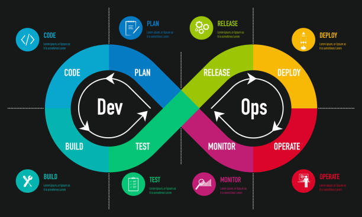

## Descrição

[Descreva brevemente as alterações feitas nesta solicitação de pull request e como elas abordam as necessidades do projeto]

## Alterações Realizadas

- [ ] Analisou-se o código e verificou-se as necessidades do projeto como um todo.

- [ ] Comentários foram adicionados para explicar a lógica por trás das alterações.

- [ ] Sugestões de mudanças foram incorporadas ao código, onde aplicável.

- [ ] As mudanças propostas são objetivas e buscam melhorar o código existente.

- [ ] O feedback fornecido é respeitoso e construtivo.

- [ ] As alterações foram testadas.

## Checklist de Revisão

- [ ] Os requisitos do projeto foram considerados ao fazer essas alterações.

- [ ] O código está adequadamente comentado para facilitar a compreensão.

- [ ] Sugestões de mudanças foram fornecidas quando necessário para melhorar o código.

- [ ] As alterações propostas são claras, objetivas e ajudam a melhorar o código existente.

- [ ] O feedback fornecido é respeitoso e construtivo.

## Notas Adicionais

[Adicione quaisquer notas adicionais ou informações relevantes sobre esta solicitação de pull request]
